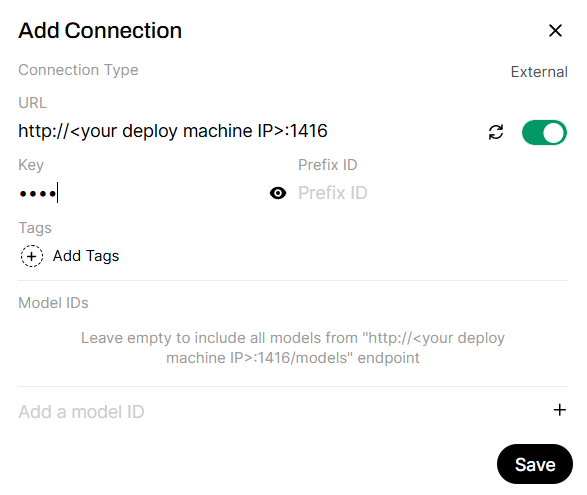
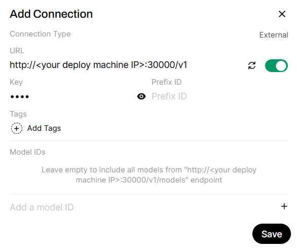
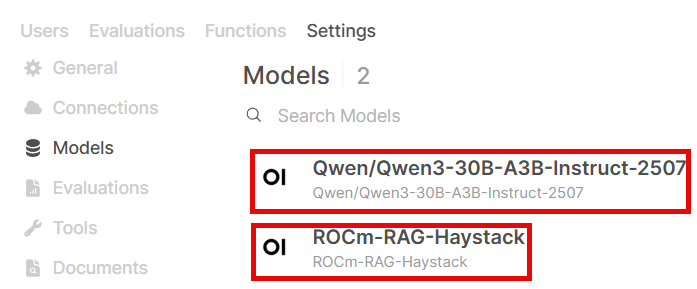
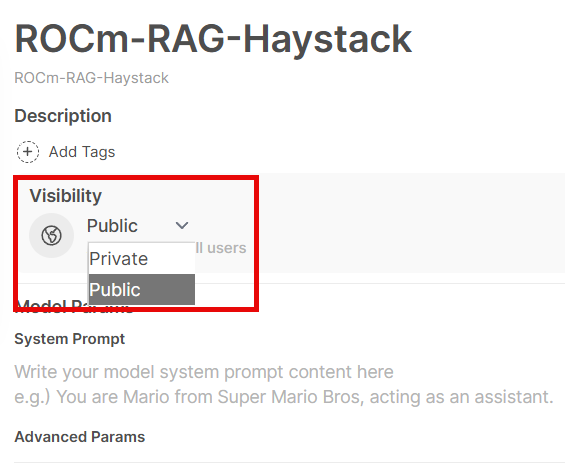
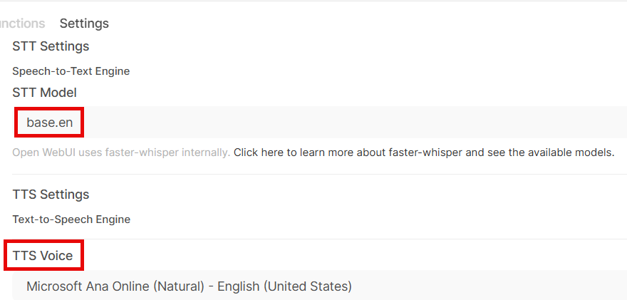
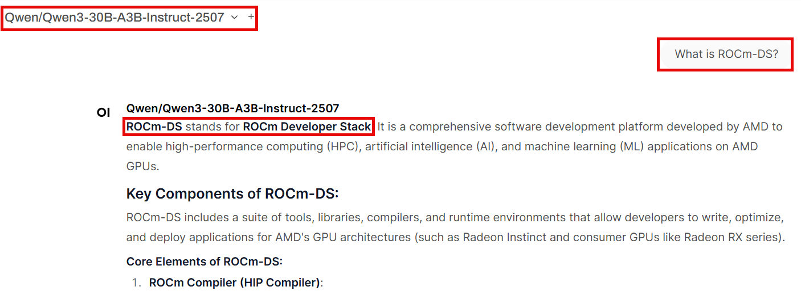

# ROCm RAG Workflow

This repository provides resources and code to build Retrieval-Augmented Generation (RAG) workflows running on AMD GPUs. It outlines the necessary steps and components required to construct a complete RAG pipeline.

## Docker Image
You can build docker image using dockerfile, or pull prebuilt docker image from dockerhub
#### Build Docker Image

```
git clone https://github.com/ROCm/rocm-rag.git --recursive
cd rocm-rag
# Build docker image 
docker build -t rocm-rag -f docker/rocm.Dockerfile . 
```

#### Pull prebuilt docker image

```
docker pull <image_name>:<tag>
```

## RAG Framework Options

The current implementation leverages two widely adopted RAG frameworks:

- **[Haystack](https://haystack.deepset.ai/):** An open-source framework designed for building search systems, QA pipelines, and RAG workflows.
- **[LangGraph](https://www.langchain.com/langgraph):** A modular framework tailored for developing applications powered by language models.   

Both frameworks are actively maintained and widely used in the field of LLM-based application development.   
You can configure the framework to use by setting enironment variables when running the docker container
```
# Options: haystack, langgraph
ROCM_RAG_EXTRACTION_FRAMEWORK=haystack
ROCM_RAG_RETRIEVAL_FRAMEWORK=haystack
```

## Inferencing Framework Options
- **[SGLang](https://github.com/sgl-project/sglang.git):** LLM serving engine known for radix tree caching and speculative decoding for ultra-fast inference
- **[vLLM](https://github.com/vllm-project/vllm.git):** An efficient LLM inference library built around PagedAttention for fast, memory-optimized serving.
- **[llama.cpp](https://github.com/ggml-org/llama.cpp.git):** A lightweight C/C++ inference framework for running GGUF-quantized LLMs locally on CPUs and GPUs.

Follow the setup guide to deploy your inference server. If you prefer to test the pipeline **without** deploying your own inference server, enable the example LLM by setting the following env variable:
```
ROCM_RAG_USE_EXAMPLE_LLM=True
```
<span style="color:green">**By default, this will launch `Qwen/Qwen3-30B-A3B-Instruct-2507` using vLLM inside the provided Docker container on GPU 2,3.**</span> You can skip next step if you use example LLM model inside this docker.   

If you set `ROCM_RAG_USE_EXAMPLE_LLM=False`, please follow the following steps to deploy LLM inference server outside the ROCm-RAG container.

**SGLang**   
Deploy DeepSeek V3.1
```
# on a separate node
docker run --cap-add=SYS_PTRACE --ipc=host --privileged=true \
        --shm-size=128GB --network=host --device=/dev/kfd \
        --device=/dev/dri --group-add video -it \
        -v <mount dir>:<mount dir> \
lmsysorg/sglang:v0.4.4-rocm630

RCCL_MSCCL_ENABLE=0 CK_MOE=1  HSA_NO_SCRATCH_RECLAIM=1  python3 -m sglang.launch_server --model-path deepseek-ai/DeepSeek-V3.1 --host 0.0.0.0 --port 30000 --tp 8 --trust-remote-code
```
**vLLM**    
Please refer to https://rocm.blogs.amd.com/software-tools-optimization/vllm-0.9.x-rocm/README.html   

**llama.cpp**      
Deploy unsloth/DeepSeek-V3.1-GGUF   

build llama.cpp docker image
```
git clone https://github.com/ROCm/llama.cpp
cd llama.cpp/
docker build -t local/llama.cpp:rocm6.4_ubuntu24.04-complete --target build -f .devops/rocm.Dockerfile .
```

pulling GGUF checkpoints outside the container
```
from huggingface_hub import snapshot_download

# Define the model repository and destination directory
model_id = "unsloth/DeepSeek-V3.1-GGUF"
local_dir = "<your huggingface cache directory>/hub/models--unsloth--DeepSeek-V3.1-GGUF"

# Download only files matching the pattern "DeepSeek-V3.1-Q4_K_M*"
snapshot_download(
    repo_id=model_id,
    local_dir=local_dir,
    local_dir_use_symlinks=False,
    allow_patterns=["Q4_K_M/DeepSeek-V3.1-Q4_K_M*"]
)

print(f"Downloaded GGUF file(s) matching pattern to: {local_dir}")
```

start your docker container with your checkpoints directory mounted
```
docker run --cap-add=SYS_PTRACE --ipc=host --privileged=true \
        --shm-size=128GB --network=host --device=/dev/kfd \
        --device=/dev/dri --group-add video -it \
        -v <your huggingface cache directory on host>:<your huggingface cache directory inside container> \
local/llama.cpp:rocm6.4_ubuntu24.04-complete
```

and inside your container launch llama.cpp HTTP server
```
cd /app/build/bin
./llama-server -m <your huggingface cache directory inside the container>/hub/models--unsloth--DeepSeek-V3.1-GGUF/Q4_K_M/DeepSeek-V3.1-Q4_K_M-00001-of-00009.gguf -ngl 999 -np 4 --alias unsloth/DeepSeek-V3.1-Q4_K_M --host 0.0.0.0 --port 30000
```
Please make sure you set correct APIs for LLM server related env variables once you finish setting up your inference server.    


## Configuring Extraction and Retrieval Parameters
You can configure both **extraction** and **retrieval** parameters by setting environment variables for the Docker container.
#### Steps to configure
1. Review the list of environment variables carefully.
2. Set each variable to the correct value based on your configuration and needs.
#### Options for setting environment variables
**1. Using an env file**
- Start with [default.env](default.env) as a base.
- Modify the variables as needed and provide the env file when running the container:

```
docker run --env-file <your env file> ...
```
**2. Setting variables one by one during docker run**
```
docker run -e VAR1=value1 -e VAR2=value2 ...
```
**3. Export variables inside the container** (If you are running container in interactive mode)
```bash
export VAR1=value1
export VAR2=value2
```

Make sure all variables are set correctly to ensure the extraction and retrieval pipelines run as expected.

Below is a list of environment variables you may modify as needed:     

**workspace & storage**
```   
ROCM_RAG_WORKSPACE # ROCm-RAG workspace directory
ROCM_RAG_HASH_DIR # directory to save page-level hash
ROCM_RAG_VISITED_URL_FILE # file to save list of scraped URLs
```
**extraction parameters**
```
ROCM_RAG_EXTRACTION_FRAMEWORK # extraction RAG framework
ROCM_RAG_HAYSTACK_SERVER_PORT # haystack pipeline server port
ROCM_RAG_LANGGRAPH_SERVER_PORT # langgraph server port
ROCM_RAG_EMBEDDER_MODEL # embedder model
ROCM_RAG_EMBEDDER_API_BASE_URL # embedder API base URL
ROCM_RAG_EMBEDDER_API_PORT # embedder API port
ROCM_RAG_EMBEDDER_MAX_TOKENS # embedder model max token limit
ROCM_RAG_WEAVIATE_URL # weaviate db API base URL
ROCM_RAG_WEAVIATE_PORT # weaviate db API port
ROCM_RAG_WEAVIATE_CLASSNAME # weaviate classname
ROCM_RAG_WAIT_VECTOR_DB_TIMEOUT # wait time for vector db server to be ready
ROCM_RAG_WAIT_EMBEDDER_TIMEOUT # wait time for embedder server to be ready
ROCM_RAG_EMBEDDER_GPU_IDS # list of visible GPUs when deploy embedder model
ROCM_RAG_START_URLS # start URL for scraping
ROCM_RAG_VALID_EXTENSIONS # list of supported URL extensions to scrape
ROCM_RAG_VALID_PAGE_FILTERS # list of regex filters for selecting valid pages to scrape
ROCM_RAG_REQUIRE_HUMAN_VERIFICATION_FILTERS # list of regex filters for identifying pages that require human verification
ROCM_RAG_PAGE_NOT_FOUND_FILTERS # list of regex filters for identifying not found pages
ROCM_RAG_SET_MAX_NUM_PAGES # enable limit on the maximum number of pages to scrape
ROCM_RAG_MAX_NUM_PAGES # maximum number of pages to scrape
ROCM_RAG_MAX_CHUNK_LENGTH # maximum number of tokens for SemanticChunkMerger
ROCM_RAG_SIMILARITY_THRESHOLD # similarity threshold for SemanticChunkMerger to merge
```

**retrieval parames**
```
ROCM_RAG_RETRIEVAL_FRAMEWORK # retrieval RAG framework
ROCM_RAG_USE_EXAMPLE_LLM # deploy example LLM inference server inside this docker
ROCM_RAG_LLM_API_BASE_URL # LLM API base URL
ROCM_RAG_LLM_API_PORT # LLM API port
ROCM_RAG_LLM_MODEL # LLM model
ROCM_RAG_LLM_TP # tensor parallism
ROCM_RAG_LLM_GPU_IDS # visible GPUs for example LLM
ROCM_RAG_HAYSTACK_CERTAINTY_THRESHOLD # certainty threshold for retrieval
ROCM_RAG_HAYSTACK_TOP_K_RANKING # top K retrieved documents for haystack retrieval pipeline
ROCM_RAG_LANGGRAPH_TOP_K_RANKING # top K retrieved documents for langgraph retrieval pipeline
```


## Instructions

### Running ROCm-RAG docker container
You can run the ROCm RAG container in two ways, depending on whether you want an interactive session or to execute the pipelines directly.
### 1. Interactive mode
Use interactive mode for exploring and debugging the container manually   

#### 1.1 start the container and open a bash session
```
docker run --cap-add=SYS_PTRACE --ipc=host --privileged=true \
        --shm-size=128GB --network=host --device=/dev/kfd \
        --device=/dev/dri --group-add video -it \
        -v <mount dir>:<mount dir> \
rocm-rag:latest
```

#### 1.2 Run extraction pipeline   
By default the scraper will scrape all blog pages starting from [ROCm Blogs Home](https://rocm.blogs.amd.com/index.html). You can limit the scope of scraping by setting the following env variables.
Here's an example of scraping a single blog page about ROCm-DS, so the extraction pipeline will build the knowledge base only on this blog page.
```
export ROCM_RAG_START_URLS="https://rocm.blogs.amd.com/software-tools-optimization/introducing-rocm-ds-revolutionizing-data-processing-with-amd-instinct-gpus/README.html"
export ROCM_RAG_SET_MAX_NUM_PAGES=True
export ROCM_RAG_MAX_NUM_PAGES=1
```
Then start the extraction pipeline. By default page hash database is under /rag-workspace/rocm-rag/hash and weaviate persistent data is under /rag-workspace/rocm-rag/data, please make sure you mount these directories to your host directories so that you can reuse the extracted data in the future. 
```
cd rocm-rag/scripts
bash run-extraction-tmux.sh # OR bash run-extraction.sh
```
You can switch to different bash terminal window by `tmux select-window -t <window ID>`.   
logs for extraction components can be found under 
```
/rag-workspace/rocm-rag/logs 
```
The extraction script will crawl, scrape, chunk, index and save content to database for future use. At the end of scraping and indexing you should see a message "All URLs found: `<your starting URL`>" in extraction.log.


#### 1.3 Validate Extraction Result
Once finished you should be able to run a quick test to retrieve content from weaviate vector db.
```
cd /rag-workspace/rocm-rag/tests/examples
python weaviate_client_example.py
```
This will pull and print out all scraped and indexed chunks from starting URL.

#### 1.4 SSL certificate and enable HTTPs      
Access to the ASR feature requires microphone permissions for some browsers, which in turn necessitate a secure HTTPS connection. This guide provides instructions for configuring HTTPS using a self-signed certificate for testing purposes only. **This approach must not be used in production environments**. For production deployments, configure a valid domain name and obtain an SSL/TLS certificate from a trusted certificate authority.  
Get machine IP 
```
# get private IP inside LAN
apt install net-tools && ifconfig
```
Once you get the IP address, create self-signed certificate with SAN included.
```
mkdir -p /etc/nginx/ssl
openssl req -x509 -nodes -days 365 -newkey rsa:2048 \
  -keyout /etc/nginx/ssl/selfsigned.key \
  -out /etc/nginx/ssl/selfsigned.crt \
  -subj "/C=US/ST=Local/L=Local/O=Local/CN=<your machine IP>" \
  -addext "subjectAltName=IP:<your machine IP>"
```
This creates self-signed SSL certificate valid for 365 days and saved to /etc/nginx/ssl/selfsigned.crt, together with a new RSA private key saved to /etc/nginx/ssl/selfsigned.key   
 
start nginx if nginx is not running
```
nginx
```
```
cat <<'EOF' >> /etc/nginx/sites-available/default
server {
    listen 443 ssl;
    listen [::]:443 ssl;
    server_name <your IP address>;  # Accept any hostname

    ssl_certificate     /etc/nginx/ssl/selfsigned.crt;
    ssl_certificate_key /etc/nginx/ssl/selfsigned.key;

    location / {
        proxy_pass http://localhost:8080;
        proxy_set_header Host $host;
        proxy_set_header X-Real-IP $remote_addr;
        proxy_set_header Accept-Encoding "";
        proxy_set_header X-Forwarded-Scheme $scheme;
        proxy_set_header X-Forwarded-Proto $scheme;
        proxy_set_header X-Forwarded-For $proxy_add_x_forwarded_for;

        # Websockets
        proxy_http_version 1.1;
        proxy_set_header Upgrade $http_upgrade;
        proxy_set_header Connection "upgrade";
        ##
        # Disable buffering for the streaming responses (SSE)
        chunked_transfer_encoding off;
        proxy_buffering off;
        proxy_cache off;
        ##
        # Conections Timeouts (1hr)
        keepalive_timeout 3600;
        proxy_connect_timeout 3600;
        proxy_read_timeout 3600;
        proxy_send_timeout 3600;
        ##
    }
}
EOF
```
reload nginx
```
nginx -t
nginx -s reload
```

#### 1.5 Run retrieval pipeline   
```
cd rocm-rag/scripts
bash run-retrieval-tmux.sh # OR bash run-retrieval.sh
```
You can switch to different bash terminal window by `tmux select-window -t <window ID>`.   
All retrieval component logs are stored in:
```
/rag-workspace/rocm-rag/logs
```
After the retrieval process completes, you should see the following message in both example_llm_retrieval.log and embedder_retrieval.log:
```bash
INFO:     Application startup complete.
```

### 2. Direct Execution
Use direct execution to run the extraction and retrieval pipelines automatically without entering the container. You can also limit the scope of scraping like [1.2 Run extraction pipeline](#12-run-extraction-pipeline)
```
docker run --env-file <your env file> --cap-add=SYS_PTRACE --ipc=host --privileged=true \
           --shm-size=128GB --network=host \
           --device=/dev/kfd --device=/dev/dri \
           --group-add video -it \
           -v <mount dir>:<mount dir> \
           rocm-rag:latest /bin/bash -c \
           "cd /rag-workspace/rocm-rag && \
            bash run-extraction.sh && \
            bash run-retrieval.sh"
```
Directly running the container will NOT include HTTPs setup, thus microphone might be blocked by your browser in this approach.
By default, logs are written to:
```
/rag-workspace/rocm-rag/logs
```
inside the container. To view them on your host machine, mount this directory to a local path.
Both the extraction and retrieval logs should display the same messages as described [here](#12-run-extraction-pipeline) and [here](#15-run-retrieval-pipeline).

## Start RAG Pipeline Testing via Open-WebUI Frontend  
### 1. Setup Open-WebUI
This workflow uses [open-webui](https://github.com/open-webui/open-webui) as example frontend.    
**After your retrieval pipeline is up and running** (make sure all components are ready by checking logs), you can access the Open-WebUI frontend by navigating to https://\<Your deploy machine IP\> or http://\<Your deploy machine IP\>:8080   

Setting up new open-webui account, user data are saved to /rag-workspace/rocm-rag/external/open-webui/backend/data   


Go to admin panel   


check enable user sign ups to allow new user registration. User data will be saved to /rag-workspace/rocm-rag/external/open-webui/backend/data/webui.db


Add APIs to RAG server (by default haystack is running on port 1416 if haystack is chosen, langgraph is running on port 20000 if langgraph is chosen)



Add APIs to example LLM server (if ROCM_RAG_USE_EXAMPLE_LLM=True, otherwise replace this API URL with your inference server URL)



IPs in this example
```
http://<Your deploy machine IP>:1416 -> haystack server, provides ROCm-RAG-Haystack if Haystack is chosen as RAG framework
http://<Your deploy machine IP>:20000/v1 -> langgraph server, provides ROCm-RAG-Langgraph if Langgraph is chosen as RAG framework
http://<Your deploy machine IP>:30000/v1 -> Qwen/Qwen3-30B-A3B-Instruct-2507 inferencing server if ROCM_RAG_USE_EXAMPLE_LLM=True
```

List of models provided by above APIs. This is retrieved by calling http GET API_URL:PORT/v1/models      

**ROCm-RAG-*: RAG retrieval pipeline**   
**Qwen/Qwen3-30B-A3B-Instruct-2507: Example LLM inference server**

If both appear, the RAG pipeline is running successfully.



model settings, models are by default only accessible by admin, make sure to share the model to public (all registered users) or private groups   



Select which fast whisper model (**[List of models provided by fast-whisper](https://github.com/SYSTRAN/faster-whisper/blob/d3bfd0a305eb9d97c08047c82149c1998cc90fcb/faster_whisper/utils.py#L12)**) and which TTS voice to use.   



### 2. Comparing RAG Pipeline vs Direct LLM Responses

Select Qwen/Qwen3-30B-A3B-Instruct-2507 from the model dropdown and ask:
```
What is ROCm-DS?
```
Since ROCm-DS is a newly developed GPU-accelerated data science toolkit by AMD, the direct LLM output may contain hallucinations.



Ask the same question using a ROCm-RAG-* model. The RAG pipeline should return the correct definition of ROCm-DS, leveraging the knowledge base built in the previous steps.


The screenshot of the ROCm-DS blog page confirms that the correct definition of ROCm-DS refers to AMD’s GPU-accelerated data science toolkit.


## Move weaviate data
This repository provides examples and guidance for moving data between different storages. Data migration can be approached in two ways:   

**Cluster Migration (Backup & Restore)**   
Move entire clusters across different storage backends.
Achieved using Weaviate’s built-in backup and restore functionality.

**Raw Data Migration (Export & Import)**   
Move only the raw data objects.
Achieved by exporting collections to a JSON file and importing them into another machine.

Example: Export & Import with JSON   
The following example demonstrates how to export one collection from weaviate db and save to /rag-workspace/rocm-rag/backup/rocm_rag_backup_data.json. On source machine with weaviate instance running
```
python /rag-workspace/rocm-rag/rocm_rag/data/weaviate_export_data.py
```

The following example demonstrates how to Load the .json file and import into the target machine’s Weaviate instance. On target machine with weaviate instance running
```
python /rag-workspace/rocm-rag/rocm_rag/data/weaviate_import_data.py
```

This approach is useful when you only need to migrate the dataset without transferring cluster configuration or storage state.
