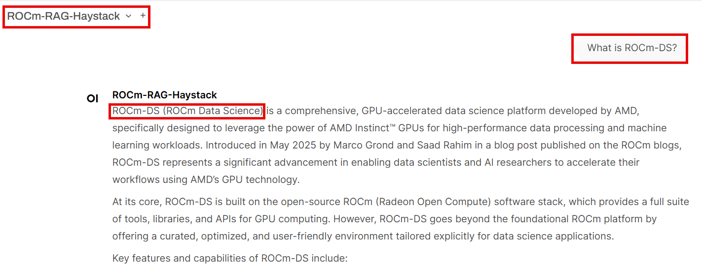
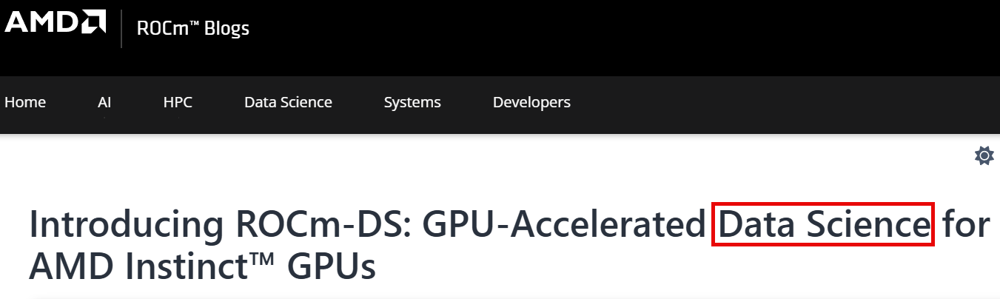

.. meta::
  :description: Test the ROCm-RAG pipelines with Open-WebUI
  :keywords: RAG, ROCm, extraction, pipelines, how-to, container, Open-WebUI

**************************************
Test the RAG pipelines with Open-WebUI
**************************************

After you've executed the ROCm-RAG pipelines, you can test them with `Open-WebUI <https://github.com/open-webui/open-webui>`__. 
When your retrieval pipeline is up and running (make sure all components are ready by checking the logs), 
you can access the Open-WebUI frontend by navigating to ``https://<Your deploy machine IP>`` or ``http://<Your deploy machine IP>:8080``.   

When you set up a new Open-WebUI account, your user data is saved to ``/rag-workspace/rocm-rag/external/open-webui/backend/data``.  

Set up and test pipelines with Open-WebUI
=========================================

To set up and test with Open-WebUI:

1. Go to the admin panel:  

   .. image:: ../images/main_page.png

2. Select **Enable User Sign Ups** to allow new user registration. User data saves to ``/rag-workspace/rocm-rag/external/open-webui/backend/data/webui.db``:

   .. image:: ../images/admin_general.png

3. Add the APIs to the RAG server (by default, haystack is running on port ``1416`` and langgraph is running on port ``20000``):

   .. image:: ../images/admin_add_new_connection_rag.png

4. Add APIs to the example LLM server (if ``ROCM_RAG_USE_EXAMPLE_LLM=True``, otherwise replace this API URL with your inference server URL):

   .. image:: ../images/admin_add_new_connection_llm.png

- Here are the IPs used in this example:

  .. code::

     http://<Your deploy machine IP>:1416 -> haystack server, provides ROCm-RAG-Haystack if Haystack is chosen as RAG framework
     http://<Your deploy machine IP>:20000/v1 -> langgraph server, provides ROCm-RAG-Langgraph if Langgraph is chosen as RAG framework
     http://<Your deploy machine IP>:30000/v1 -> Qwen/Qwen3-30B-A3B-Instruct-2507 inferencing server if ROCM_RAG_USE_EXAMPLE_LLM=True

- Here's a list of models provided by these APIs. This is retrieved by calling ``http GET API_URL:PORT/v1/models``:  

  .. image:: ../images/admin_list_of_models.png

- These are the model settings. By default, models are only accessible by admin. Make sure you share the model to public (all registered users) or private groups:  

  .. image:: ../images/admin_model_settings.png

5. Select which fast whisper model (here's a `list of models provided by fast-whisper <https://github.com/SYSTRAN/faster-whisper/blob/d3bfd0a305eb9d97c08047c82149c1998cc90fcb/faster_whisper/utils.py#L12>`__) and which TTS voice to use:   

   .. image:: ../images/admin_audio.png

Comparing the RAG pipeline against direct LLM responses
=======================================================

You can test the accuracy of the ROCm-RAG pipelines through direct LLM responses. 
As an example, select **Qwen/Qwen3-30B-A3B-Instruct-2507** from the model drop-down and ask: ``What is ROCm-DS?``. 
Since ROCm-DS is a newer GPU-accelerated data science toolkit by AMD, the direct LLM output may contain hallucinations:

.. image:: ../images/direct_llm_response.png

Then ask the LLM ``What is ROCm-DS?`` using a ROCm-RAG-* model. The RAG pipeline returns the correct definition of ROCm-DS, leveraging the knowledge base built in the previous steps:

This screenshot of the ROCm-DS blog page confirms that the correct definition of ROCm-DS refers to AMD's GPU-accelerated data science toolkit:

